Overview
========

This vignette fits the cholera transmission model to weekly case counts
from Kirotshe health zone. The data are weekly IDSR counts, so the
observation model is a count model rather than a model for per-capita
rates.

The aim is to build up a stable pMCMC workflow for a deliberately small
model. We fix the intervention dates and most natural-history
parameters, set person-to-person transmission to zero, and estimate four
quantities:

-   `trans_prob`: environmental transmission probability;
-   `reporting_rate`: the fraction of symptomatic infections reported as
    cases;
-   `obs_size`: the Negative Binomial overdispersion parameter;
-   `E0`: the initial exposed population.

The workflow has two important features. First, we use
deterministic-filter chains to learn the geometry of the posterior
before running the particle filter. Second, we run several chains from
dispersed starting points, because agreement between chains is one of
the simplest checks that the fit is not just following its starting
value.

Weekly observations
===================

The model has both daily and weekly incidence accumulators. Daily
workflows use `inc_symptoms`; weekly workflows use
`inc_symptoms_weekly`. For weekly data the likelihood is

cases<sub>*t*</sub> ∼ Negative Binomial{*μ*<sub>*t*</sub>, obs\_size},   *μ*<sub>*t*</sub> = reporting\_rate × inc\_symptoms\_weekly<sub>*t*</sub>.

The first weekly observation is placed at `time = 7`, so it is compared
with incidence accumulated over days 0 to 7. This is why
`chlaa_fit_pmcmc()` starts weekly filters at day 0 when observations are
at `7, 14, ...`.

Kirotshe data
=============

The package includes a small Kirotshe-only extract for this workflow. It
contains the weekly outbreak counts and the intervention dates/effects
needed for the fit; the larger analysis datasets remain outside the
package build. Population size comes from the weekly IDSR extract and is
passed to the process model as `N`.

``` r
repo_file <- function(...) {
  candidates <- c(file.path(...), file.path("..", ...))
  out <- candidates[file.exists(candidates)][1]
  if (is.na(out)) stop("Could not find file: ", file.path(...), call. = FALSE)
  out
}

repo_output_file <- function(...) {
  roots <- c(".", "..")
  root <- roots[file.exists(file.path(roots, "DESCRIPTION"))][1]
  if (is.na(root)) stop("Could not find repository root", call. = FALSE)
  file.path(root, ...)
}

extdata_file <- function(...) {
  out <- system.file("extdata", ..., package = "chlaa")
  if (nzchar(out)) return(out)
  repo_file("inst", "extdata", ...)
}

hz_name <- "kirotshe"

kirotshe <- read_csv(extdata_file("kirotshe_weekly_cases.csv"), show_col_types = FALSE) |>
  mutate(date = as.Date(date))

kirotshe_meta <- read_csv(
  extdata_file("kirotshe_interventions.csv"),
  col_types = cols(.default = col_character()),
  na = c("NA", "")
)

outbreak_start <- as.Date(kirotshe_meta$outbreak_start)
outbreak_end <- as.Date(kirotshe_meta$outbreak_end)

kirotshe |>
  select(date, time, cases, population, cases_pop) |>
  head()
#> # A tibble: 6 × 5
#>   date        time cases population  cases_pop
#>   <date>     <dbl> <dbl>      <dbl>      <dbl>
#> 1 2025-01-13     7    15     515741 0.0000291 
#> 2 2025-01-20    14     5     515741 0.00000969
#> 3 2025-01-27    21    14     515741 0.0000271 
#> 4 2025-02-03    28     8     515741 0.0000155 
#> 5 2025-02-10    35     9     515741 0.0000175 
#> 6 2025-02-17    42    25     515741 0.0000485
```

The model time is a consecutive weekly index. If reporting weeks are
missing in a formal analysis, decide before fitting whether those weeks
should be padded or whether the observed time gaps should be preserved.

``` r
ggplot(kirotshe, aes(date, cases)) +
  geom_col(width = 6, fill = "grey65") +
  labs(
    x = NULL,
    y = "Weekly reported cases",
    title = "Kirotshe IDSR outbreak window"
  )
```

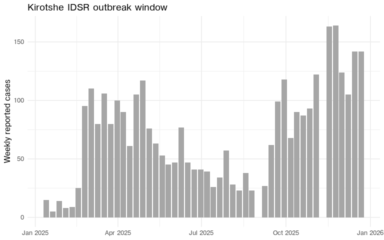

Interventions and fixed parameters
==================================

The parameter file stores intervention dates as calendar dates. The
model uses day offsets relative to the outbreak start.

``` r
date_to_day <- function(x, origin) {
  d <- as.Date(x)
  if (length(d) == 0 || is.na(d)) 0L else as.integer(d - origin)
}

num_or <- function(x, default = 0) {
  y <- suppressWarnings(as.numeric(x))
  if (length(y) == 0 || is.na(y)) default else y
}

intervention_days <- list(
  orc_start = date_to_day(kirotshe_meta$orc_start, outbreak_start),
  orc_end = date_to_day(kirotshe_meta$orc_end, outbreak_start),
  ctc_start = date_to_day(kirotshe_meta$ctc_start, outbreak_start),
  ctc_end = date_to_day(kirotshe_meta$ctc_end, outbreak_start),
  chlor_start = date_to_day(kirotshe_meta$chlor_start, outbreak_start),
  chlor_end = date_to_day(kirotshe_meta$chlor_end, outbreak_start),
  chlor_effect = num_or(kirotshe_meta$chlor_effect),
  hyg_start = date_to_day(kirotshe_meta$hyg_start, outbreak_start),
  hyg_end = date_to_day(kirotshe_meta$hyg_end, outbreak_start),
  hyg_effect = num_or(kirotshe_meta$hyg_effect),
  cati_start = date_to_day(kirotshe_meta$cati_start, outbreak_start),
  cati_end = date_to_day(kirotshe_meta$cati_end, outbreak_start),
  cati_effect = num_or(kirotshe_meta$cati_effect),
  lat_start = date_to_day(kirotshe_meta$lat_start, outbreak_start),
  lat_end = date_to_day(kirotshe_meta$lat_end, outbreak_start),
  lat_effect = num_or(kirotshe_meta$lat_effect)
)

tibble(
  quantity = names(intervention_days),
  value = unlist(intervention_days)
)
#> # A tibble: 16 × 2
#>    quantity     value
#>    <chr>        <dbl>
#>  1 orc_start     70  
#>  2 orc_end      224  
#>  3 ctc_start     70  
#>  4 ctc_end      238  
#>  5 chlor_start  119  
#>  6 chlor_end    238  
#>  7 chlor_effect   0.2
#>  8 hyg_start     84  
#>  9 hyg_end      224  
#> 10 hyg_effect     0.2
#> 11 cati_start   133  
#> 12 cati_end     245  
#> 13 cati_effect    0.1
#> 14 lat_start      0  
#> 15 lat_end        0  
#> 16 lat_effect     0
```

For this example we use one small parameter factory. Everything not
listed in the function arguments is fixed across the fits.

``` r
make_kirotshe_pars <- function(trans_prob,
                               reporting_rate,
                               obs_size,
                               E0) {
  do.call(
    chlaa_parameters,
    c(
      list(
        N = kirotshe$population[1],
        contact_rate = 0,
        trans_prob = trans_prob,
        E0 = E0,
        Sev0 = 0,
        M0 = 0,
        C0 = 0,
        reporting_rate = reporting_rate,
        obs_size = obs_size,
        seek_severe = 0.4,
        fatality_treated = 0.001,
        fatality_untreated = 0.0043
      ),
      intervention_days
    )
  )
}
```

Simulated weekly data
=====================

We first make a synthetic dataset on the Kirotshe time grid. This gives
us a known truth for checking whether the workflow can recover the
parameters before we fit the real outbreak.

``` r
truth_pars <- make_kirotshe_pars(
  trans_prob = 8.5e-4,
  reporting_rate = 0.35,
  obs_size = 120,
  E0 = 80
)

truth <- chlaa_simulate(
  pars = truth_pars,
  time = kirotshe$time,
  n_particles = 1,
  seed = 1,
  dt = 1,
  deterministic = TRUE
)

set.seed(1)
synthetic_weekly <- kirotshe |>
  transmute(
    time,
    date,
    population,
    inc_symptoms_truth = truth$inc_symptoms_weekly,
    mu_cases = truth_pars$reporting_rate * inc_symptoms_truth,
    cases = rnbinom(n(), mu = pmax(mu_cases, 0.01), size = truth_pars$obs_size)
  )

natural_fit_names <- c("trans_prob", "reporting_rate", "obs_size", "E0")
truth_vec <- unlist(truth_pars[natural_fit_names])
truth_values <- tibble(parameter = names(truth_vec), truth = as.numeric(truth_vec))

truth_values
#> # A tibble: 4 × 2
#>   parameter          truth
#>   <chr>              <dbl>
#> 1 trans_prob       0.00085
#> 2 reporting_rate   0.35   
#> 3 obs_size       120      
#> 4 E0              80
```

``` r
ggplot() +
  geom_col(data = synthetic_weekly, aes(date, cases), width = 6, fill = "grey70") +
  geom_line(data = synthetic_weekly, aes(date, mu_cases), colour = "#238b45", linewidth = 0.8) +
  labs(
    x = NULL,
    y = "Weekly reported cases",
    title = "Synthetic weekly data",
    subtitle = "Bars are noisy observations; the green line is the observation mean"
  )
```

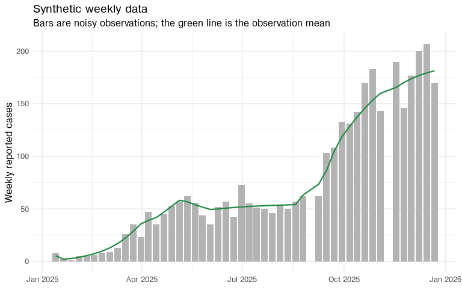

Diagnostic helpers
==================

The next few helpers are used to summarise the chains. The code is
intentionally short: fitting itself is handled by `chlaa_fit_pmcmc()`,
including multiple chains through `n_chains` and `chain_pars`.

``` r
n_chains <- 3L
pilot_steps <- 5000L
deterministic_steps <- 20000L
particle_steps <- 5000L
particle_count <- 50L
fit_data_synthetic <- synthetic_weekly |> select(time, cases)
fit_data_real <- kirotshe |> select(time, cases)
```

Effective sample size, or ESS, translates an autocorrelated MCMC chain
into the approximate number of independent samples it contains. A chain
can save 3,750 post-burn-in draws and still have an ESS of 50 if it
moves slowly. ESS is therefore a measure of information, not just
storage.

``` r
draws_wide <- function(fit, burnin = 0.25, scale = c("sampled", "natural")) {
  scale <- match.arg(scale)
  chlaa_fit_trace(fit, burnin = burnin, scale = scale) |>
    pivot_wider(names_from = parameter, values_from = value) |>
    arrange(chain, iteration)
}

acceptance_summary <- function(fit, stage, burnin = 0.25) {
  chlaa_fit_report(fit, burnin = burnin)$acceptance_by_chain |>
    mutate(stage = stage, .before = 1)
}

ess_summary <- function(fit, stage, burnin = 0.25, parameters = NULL) {
  dr <- draws_wide(fit, burnin = burnin, scale = "sampled")
  if (is.null(parameters)) {
    parameters <- setdiff(names(dr), c("chain", "iteration"))
  }

  dr |>
    group_split(chain) |>
    map_dfr(function(d) {
      ess <- coda::effectiveSize(as.matrix(d[, parameters, drop = FALSE]))
      tibble(chain = d$chain[[1]], parameter = names(ess), ess = as.numeric(ess))
    }) |>
    mutate(stage = stage, .before = 1)
}

rhat_summary <- function(fit, stage, burnin = 0.25, parameters = NULL) {
  dr <- draws_wide(fit, burnin = burnin, scale = "sampled")
  if (is.null(parameters)) {
    parameters <- setdiff(names(dr), c("chain", "iteration"))
  }

  chains <- dr |>
    group_split(chain) |>
    map(\(d) coda::mcmc(as.matrix(d[, parameters, drop = FALSE])))

  psrf <- coda::gelman.diag(
    coda::mcmc.list(chains),
    autoburnin = FALSE,
    multivariate = FALSE
  )$psrf

  tibble(
    stage = stage,
    parameter = rownames(psrf),
    rhat = psrf[, "Point est."],
    rhat_upper = psrf[, "Upper C.I."]
  )
}
```

Posterior summaries are easier to read on the natural scale. For the
synthetic example we can also record whether the true value lies in the
central 95% posterior interval.

``` r
parameter_summary <- function(fit, stage, burnin = 0.25, truth = NULL) {
  out <- draws_wide(fit, burnin = burnin, scale = "natural") |>
    select(all_of(natural_fit_names)) |>
    pivot_longer(everything(), names_to = "parameter", values_to = "value") |>
    group_by(parameter) |>
    summarise(
      q025 = quantile(value, 0.025),
      median = median(value),
      q975 = quantile(value, 0.975),
      .groups = "drop"
    ) |>
    mutate(stage = stage, .before = 1)

  if (!is.null(truth)) {
    out <- out |>
      left_join(tibble(parameter = names(truth), truth = as.numeric(truth)), by = "parameter") |>
      mutate(covers_truth = q025 <= truth & truth <= q975)
  }

  out
}
```

The proposal covariance learned from a pilot run must be positive
definite. The `make_pd()` helper symmetrises the covariance matrix,
floors very small or negative eigenvalues, and reconstructs a valid
covariance matrix. This prevents numerical failures when the empirical
covariance is nearly singular.

``` r
make_pd <- function(x, min_eig = 1e-10) {
  x <- (x + t(x)) / 2
  eig <- eigen(x, symmetric = TRUE)
  eig$values <- pmax(eig$values, min_eig)
  out <- eig$vectors %*% diag(eig$values, nrow = length(eig$values)) %*% t(eig$vectors)
  dimnames(out) <- dimnames(x)
  out
}

proposal_from_fit <- function(fit, burnin = 0.25, scale = 1) {
  dr <- draws_wide(fit, burnin = burnin, scale = "sampled")
  theta <- as.matrix(dr[, setdiff(names(dr), c("chain", "iteration")), drop = FALSE])
  make_pd(cov(theta) * (2.38^2 / ncol(theta)) * scale)
}
```

For particle pMCMC we start each chain from the median of the
corresponding deterministic chain.

``` r
pars_from_theta <- function(theta, template_pars, packer) {
  theta <- as.numeric(theta)
  names(theta) <- packer[["names"]]()
  unpacked <- packer[["unpack"]](theta)
  fixed_names <- names(packer[["inputs"]]()$fixed)
  update_names <- setdiff(names(unpacked), fixed_names)

  out <- template_pars
  for (nm in intersect(update_names, names(out))) {
    out[[nm]] <- unpacked[[nm]]
  }
  out
}

chain_median_starts <- function(fit, template_pars, burnin = 0.25) {
  dr <- draws_wide(fit, burnin = burnin, scale = "sampled")
  packer <- attr(fit, "packer", exact = TRUE)
  fit_names <- packer[["names"]]()

  dr |>
    group_split(chain) |>
    map(function(d) {
      theta <- vapply(fit_names, \(nm) median(d[[nm]]), numeric(1))
      pars_from_theta(theta, template_pars, packer)
    })
}
```

The posterior predictive plots use posterior draws from all chains after
burn-in.

``` r
plot_case_fit <- function(fit, observed, title, seed, burnin = 0.25) {
  fc <- chlaa_forecast_from_fit(
    fit = fit,
    time = observed$time,
    vars = "inc_symptoms_weekly",
    include_cases = TRUE,
    obs_model = "nbinom",
    n_draws = 200,
    burnin = burnin,
    seed = seed,
    dt = 1,
    deterministic = FALSE
  )

  fit_cases <- fc |>
    filter(variable == "cases") |>
    left_join(observed |> select(time, date), by = "time")

  ggplot() +
    geom_ribbon(
      data = fit_cases,
      aes(date, ymin = q0p025, ymax = q0p975),
      fill = "#6baed6",
      alpha = 0.25
    ) +
    geom_ribbon(
      data = fit_cases,
      aes(date, ymin = q0p25, ymax = q0p75),
      fill = "#6baed6",
      alpha = 0.45
    ) +
    geom_line(data = fit_cases, aes(date, q0p5), colour = "#08519c", linewidth = 0.8) +
    geom_point(data = observed, aes(date, cases), size = 1.6) +
    labs(x = NULL, y = "Weekly reported cases", title = title)
}
```

Natural-scale random walk
=========================

It is tempting to fit directly on the scale of the parameters. The
starting values below are deliberately dispersed. The synthetic truth is
included so the movement needed from each chain is visible.

``` r
make_raw_start <- function(trans_prob, reporting_rate, obs_size, E0) {
  make_kirotshe_pars(
    trans_prob = trans_prob,
    reporting_rate = reporting_rate,
    obs_size = obs_size,
    E0 = E0
  )
}

raw_starts <- list(
  make_raw_start(trans_prob = 1.6e-3, reporting_rate = 0.12, obs_size = 20, E0 = 35),
  make_raw_start(trans_prob = 4.0e-4, reporting_rate = 0.70, obs_size = 200, E0 = 200),
  make_raw_start(trans_prob = 1.2e-3, reporting_rate = 0.25, obs_size = 45, E0 = 120)
)

bind_rows(
  tibble(row = "truth", parameter = names(truth_vec), value = as.numeric(truth_vec)),
  imap_dfr(raw_starts, \(pars, chain) tibble(
    row = paste0("chain_", chain),
    parameter = natural_fit_names,
    value = unlist(pars[natural_fit_names])
  ))
) |>
  pivot_wider(names_from = parameter, values_from = value)
#> # A tibble: 4 × 5
#>   row     trans_prob reporting_rate obs_size    E0
#>   <chr>        <dbl>          <dbl>    <dbl> <dbl>
#> 1 truth      0.00085           0.35      120    80
#> 2 chain_1    0.0016            0.12       20    35
#> 3 chain_2    0.0004            0.7       200   200
#> 4 chain_3    0.0012            0.25       45   120
```

The raw-scale prior and packer estimate the same four model parameters
directly. This short deterministic run is not used for the final fit. It
is a diagnostic contrast.

``` r
raw_prior <- monty::monty_dsl({
  trans_prob ~ Uniform(1e-4, 1e-2)
  reporting_rate ~ Uniform(0.05, 0.8)
  obs_size ~ Uniform(1, 300)
  E0 ~ Uniform(5, 2000)
}, gradient = FALSE)

raw_packer <- function(pars) {
  fixed <- pars[setdiff(names(pars), natural_fit_names)]
  monty::monty_packer(scalar = natural_fit_names, fixed = fixed)
}

raw_proposal <- c(
  trans_prob = 1e-8,
  reporting_rate = 2e-4,
  obs_size = 9,
  E0 = 400
)
```

``` r
raw_fit <- chlaa_fit_pmcmc(
  data = fit_data_synthetic,
  pars = raw_starts[[1]],
  chain_pars = raw_starts,
  n_chains = n_chains,
  n_particles = 1,
  n_steps = pilot_steps,
  seed = 91,
  prior = raw_prior,
  packer = raw_packer(raw_starts[[1]]),
  proposal_var = raw_proposal,
  obs_interval = 7,
  time_start = 0,
  deterministic = TRUE
)
```

The raw-scale chains move, but they do not explore the posterior
geometry very efficiently. Parameters with small positive values,
probabilities bounded by zero and one, and large count-like parameters
all need proposal variances on very different scales.

``` r
acceptance_summary(raw_fit, "raw deterministic", burnin = 0.25)
#> # A tibble: 3 × 4
#>   stage             chain   acceptance_rate n_iterations
#>   <chr>             <chr>             <dbl>        <int>
#> 1 raw deterministic chain_1          0.0563         3750
#> 2 raw deterministic chain_2          0.0373         3750
#> 3 raw deterministic chain_3          0.0496         3750
```

``` r
ess_summary(raw_fit, "raw deterministic", burnin = 0.25)
#> # A tibble: 12 × 4
#>    stage             chain   parameter         ess
#>    <chr>             <chr>   <chr>           <dbl>
#>  1 raw deterministic chain_1 trans_prob      15.7 
#>  2 raw deterministic chain_1 reporting_rate  10.9 
#>  3 raw deterministic chain_1 obs_size         4.51
#>  4 raw deterministic chain_1 E0             113.  
#>  5 raw deterministic chain_2 trans_prob       8.63
#>  6 raw deterministic chain_2 reporting_rate   3.52
#>  7 raw deterministic chain_2 obs_size         2.31
#>  8 raw deterministic chain_2 E0             107.  
#>  9 raw deterministic chain_3 trans_prob      23.5 
#> 10 raw deterministic chain_3 reporting_rate   7.34
#> 11 raw deterministic chain_3 obs_size         4.86
#> 12 raw deterministic chain_3 E0             129.
rhat_summary(raw_fit, "raw deterministic", burnin = 0.25)
#> # A tibble: 4 × 4
#>   stage             parameter       rhat rhat_upper
#>   <chr>             <chr>          <dbl>      <dbl>
#> 1 raw deterministic trans_prob      1.21       1.62
#> 2 raw deterministic reporting_rate  1.24       1.69
#> 3 raw deterministic obs_size       10.4       20.2 
#> 4 raw deterministic E0              1.03       1.06
```

``` r
chlaa_plot_trace(
  raw_fit,
  parameters = natural_fit_names,
  burnin = 0.25,
  scale = "natural"
)
```

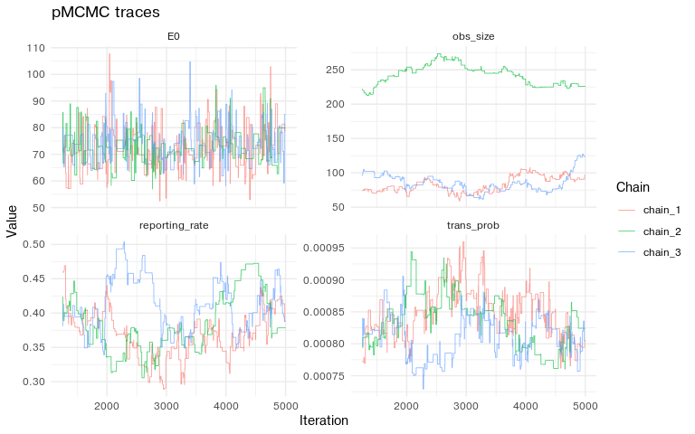

``` r
chlaa_plot_parameter_pairs(
  raw_fit,
  parameters = natural_fit_names,
  burnin = 0.25,
  scale = "natural",
  truth = truth_vec,
  max_points = 2500
)
```

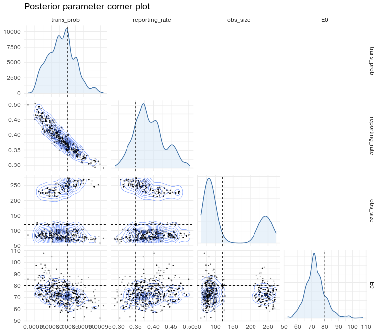

Transformed parameterisation
============================

The final workflow samples transformed coordinates:

-   `log_trans_prob` for a positive transmission probability;
-   `logit_reporting_rate` for a probability bounded by zero and one;
-   `log_obs_size` for a positive overdispersion parameter;
-   `log_E0` for a positive initial condition.

The sampler moves on this transformed scale, but the plots below use the
natural scale by default.

``` r
fit_names <- c(
  "log_trans_prob",
  "logit_reporting_rate",
  "log_obs_size",
  "log_E0"
)

fit_prior <- monty::monty_dsl({
  log_trans_prob ~ Uniform(-9.210340, -4.605170)       # log(c(1e-4, 1e-2))
  logit_reporting_rate ~ Uniform(-2.944439, 1.386294) # qlogis(c(0.05, 0.8))
  log_obs_size ~ Uniform(0, 5.703782)                 # log(c(1, 300))
  log_E0 ~ Uniform(1.609438, 7.600902)                # log(c(5, 2000))
}, gradient = FALSE)

add_transformed_values <- function(pars) {
  pars$log_trans_prob <- log(pars$trans_prob)
  pars$logit_reporting_rate <- qlogis(pars$reporting_rate)
  pars$log_obs_size <- log(pars$obs_size)
  pars$log_E0 <- log(pars$E0)
  pars
}

make_packer <- function(pars) {
  fixed <- pars[setdiff(names(pars), c(fit_names, natural_fit_names))]

  monty::monty_packer(
    scalar = fit_names,
    fixed = fixed,
    process = function(p) {
      list(
        trans_prob = exp(p$log_trans_prob),
        reporting_rate = plogis(p$logit_reporting_rate),
        obs_size = exp(p$log_obs_size),
        E0 = exp(p$log_E0)
      )
    }
  )
}
```

``` r
make_start <- function(trans_prob, reporting_rate, obs_size, E0) {
  make_kirotshe_pars(
    trans_prob = trans_prob,
    reporting_rate = reporting_rate,
    obs_size = obs_size,
    E0 = E0
  ) |>
    add_transformed_values()
}

synthetic_starts <- list(
  make_start(trans_prob = 1.6e-3, reporting_rate = 0.12, obs_size = 20, E0 = 35),
  make_start(trans_prob = 4.0e-4, reporting_rate = 0.70, obs_size = 200, E0 = 200),
  make_start(trans_prob = 1.2e-3, reporting_rate = 0.25, obs_size = 45, E0 = 120)
)
```

Synthetic fit
=============

The transformed workflow begins with a deterministic pilot. The proposal
is diagonal and deliberately simple; it only needs to move enough for us
to learn the covariance structure.

``` r
pilot_proposal <- c(
  log_trans_prob = 0.02,
  logit_reporting_rate = 0.05,
  log_obs_size = 0.08,
  log_E0 = 0.08
)

synthetic_pilot <- chlaa_fit_pmcmc(
  data = fit_data_synthetic,
  pars = synthetic_starts[[1]],
  chain_pars = synthetic_starts,
  n_chains = n_chains,
  n_particles = 1,
  n_steps = pilot_steps,
  seed = 101,
  prior = fit_prior,
  packer = make_packer(synthetic_starts[[1]]),
  proposal_var = pilot_proposal,
  obs_interval = 7,
  time_start = 0,
  deterministic = TRUE
)
```

The pilot acceptance rates should not be interpreted as final
diagnostics. They tell us whether the simple proposal was able to move
enough to estimate a useful covariance.

``` r
acceptance_summary(synthetic_pilot, "synthetic pilot")
#> # A tibble: 3 × 4
#>   stage           chain   acceptance_rate n_iterations
#>   <chr>           <chr>             <dbl>        <int>
#> 1 synthetic pilot chain_1          0.0347         3750
#> 2 synthetic pilot chain_2          0.0237         3750
#> 3 synthetic pilot chain_3          0.0320         3750
```

The learned covariance is full rather than diagonal. Off-diagonal
correlations are useful here because `trans_prob`, `reporting_rate`, and
`E0` can compensate for one another.

``` r
synthetic_det_proposal <- proposal_from_fit(
  synthetic_pilot,
  burnin = 0.25,
  scale = 1
)

round(cov2cor(synthetic_det_proposal), 2)
#>                      log_trans_prob logit_reporting_rate log_obs_size log_E0
#> log_trans_prob                 1.00                -0.95         0.06  -0.47
#> logit_reporting_rate          -0.95                 1.00        -0.05   0.27
#> log_obs_size                   0.06                -0.05         1.00  -0.02
#> log_E0                        -0.47                 0.27        -0.02   1.00
```

With the learned covariance, the deterministic chains can be run longer.
The main visual check is that chains from different starts overlap after
burn-in.

``` r
synthetic_det <- chlaa_fit_pmcmc(
  data = fit_data_synthetic,
  pars = synthetic_starts[[1]],
  chain_pars = synthetic_starts,
  n_chains = n_chains,
  n_particles = 1,
  n_steps = deterministic_steps,
  seed = 201,
  prior = fit_prior,
  packer = make_packer(synthetic_starts[[1]]),
  proposal_var = synthetic_det_proposal,
  obs_interval = 7,
  time_start = 0,
  deterministic = TRUE
)
```

``` r
acceptance_summary(synthetic_det, "synthetic deterministic")
#> # A tibble: 3 × 4
#>   stage                   chain   acceptance_rate n_iterations
#>   <chr>                   <chr>             <dbl>        <int>
#> 1 synthetic deterministic chain_1           0.326        15000
#> 2 synthetic deterministic chain_2           0.327        15000
#> 3 synthetic deterministic chain_3           0.329        15000
ess_summary(synthetic_det, "synthetic deterministic")
#> # A tibble: 12 × 4
#>    stage                   chain   parameter              ess
#>    <chr>                   <chr>   <chr>                <dbl>
#>  1 synthetic deterministic chain_1 log_trans_prob       1143.
#>  2 synthetic deterministic chain_1 logit_reporting_rate 1128.
#>  3 synthetic deterministic chain_1 log_obs_size          902.
#>  4 synthetic deterministic chain_1 log_E0               1124.
#>  5 synthetic deterministic chain_2 log_trans_prob       1129.
#>  6 synthetic deterministic chain_2 logit_reporting_rate 1055.
#>  7 synthetic deterministic chain_2 log_obs_size          963.
#>  8 synthetic deterministic chain_2 log_E0               1102.
#>  9 synthetic deterministic chain_3 log_trans_prob       1120.
#> 10 synthetic deterministic chain_3 logit_reporting_rate 1052.
#> 11 synthetic deterministic chain_3 log_obs_size          990.
#> 12 synthetic deterministic chain_3 log_E0               1329.
rhat_summary(synthetic_det, "synthetic deterministic")
#> # A tibble: 4 × 4
#>   stage                   parameter             rhat rhat_upper
#>   <chr>                   <chr>                <dbl>      <dbl>
#> 1 synthetic deterministic log_trans_prob        1.00       1.00
#> 2 synthetic deterministic logit_reporting_rate  1.00       1.00
#> 3 synthetic deterministic log_obs_size          1.00       1.00
#> 4 synthetic deterministic log_E0                1.00       1.00
```

``` r
parameter_summary(
  synthetic_det,
  "synthetic deterministic",
  truth = truth_vec
)
#> # A tibble: 4 × 7
#>   stage                   parameter     q025  median    q975  truth covers_truth
#>   <chr>                   <chr>        <dbl>   <dbl>   <dbl>  <dbl> <lgl>       
#> 1 synthetic deterministic E0         5.86e+1 7.18e+1 8.69e+1 8  e+1 TRUE        
#> 2 synthetic deterministic obs_size   5.66e+1 1.53e+2 2.86e+2 1.2e+2 TRUE        
#> 3 synthetic deterministic reporting… 3.08e-1 3.76e-1 4.63e-1 3.5e-1 TRUE        
#> 4 synthetic deterministic trans_prob 7.64e-4 8.40e-4 9.29e-4 8.5e-4 TRUE
```

``` r
chlaa_plot_trace(
  synthetic_det,
  parameters = natural_fit_names,
  burnin = 0.25,
  scale = "natural"
)
```

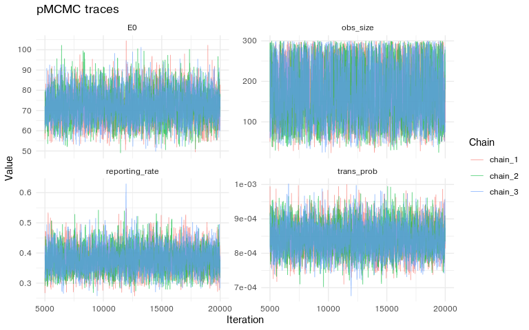

The deterministic fit is also useful for diagnosing posterior geometry.
The dashed lines mark the synthetic truth.

``` r
chlaa_plot_parameter_distributions(
  synthetic_det,
  parameters = natural_fit_names,
  burnin = 0.25,
  scale = "natural",
  truth = truth_vec
)
```

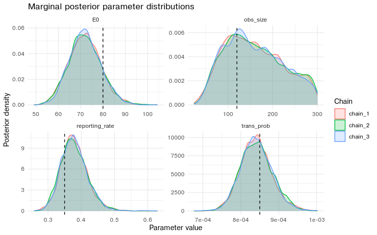

``` r
chlaa_plot_parameter_pairs(
  synthetic_det,
  parameters = natural_fit_names,
  burnin = 0.25,
  scale = "natural",
  truth = truth_vec,
  max_points = 3000
)
```

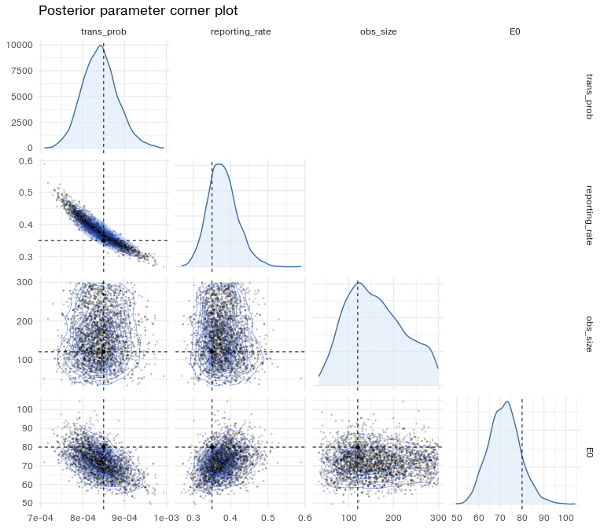

Synthetic particle pMCMC
========================

The particle-filter run uses the deterministic posterior medians as
starting points. We keep the covariance direction learned by the
deterministic fit and shrink the scale because the particle likelihood
is noisy.

``` r
synthetic_particle_starts <- chain_median_starts(
  synthetic_det,
  template_pars = synthetic_starts[[1]],
  burnin = 0.25
)
```

``` r
synthetic_particle_proposal <- proposal_from_fit(
  synthetic_det,
  burnin = 0.25,
  scale = 0.8
)
```

``` r
synthetic_particle <- chlaa_fit_pmcmc(
  data = fit_data_synthetic,
  pars = synthetic_particle_starts[[1]],
  chain_pars = synthetic_particle_starts,
  n_chains = n_chains,
  n_particles = particle_count,
  n_steps = particle_steps,
  seed = 301,
  prior = fit_prior,
  packer = make_packer(synthetic_particle_starts[[1]]),
  proposal_var = synthetic_particle_proposal,
  obs_interval = 7,
  time_start = 0,
  deterministic = FALSE
)
```

For the particle chains, acceptance is typically lower than the
deterministic pilot because each likelihood evaluation is noisy.

``` r
acceptance_summary(synthetic_particle, "synthetic particle")
#> # A tibble: 3 × 4
#>   stage              chain   acceptance_rate n_iterations
#>   <chr>              <chr>             <dbl>        <int>
#> 1 synthetic particle chain_1           0.432         3750
#> 2 synthetic particle chain_2           0.445         3750
#> 3 synthetic particle chain_3           0.428         3750
```

ESS and R-hat are complementary. ESS asks how many independent samples
the autocorrelated chain is worth; R-hat asks whether the different
chains agree.

``` r
ess_summary(synthetic_particle, "synthetic particle")
#> # A tibble: 12 × 4
#>    stage              chain   parameter              ess
#>    <chr>              <chr>   <chr>                <dbl>
#>  1 synthetic particle chain_1 log_trans_prob       238. 
#>  2 synthetic particle chain_1 logit_reporting_rate 288. 
#>  3 synthetic particle chain_1 log_obs_size         341. 
#>  4 synthetic particle chain_1 log_E0                58.5
#>  5 synthetic particle chain_2 log_trans_prob       187. 
#>  6 synthetic particle chain_2 logit_reporting_rate 222. 
#>  7 synthetic particle chain_2 log_obs_size         284. 
#>  8 synthetic particle chain_2 log_E0                43.1
#>  9 synthetic particle chain_3 log_trans_prob       223. 
#> 10 synthetic particle chain_3 logit_reporting_rate 256. 
#> 11 synthetic particle chain_3 log_obs_size         331. 
#> 12 synthetic particle chain_3 log_E0                38.4
rhat_summary(synthetic_particle, "synthetic particle")
#> # A tibble: 4 × 4
#>   stage              parameter             rhat rhat_upper
#>   <chr>              <chr>                <dbl>      <dbl>
#> 1 synthetic particle log_trans_prob        1.00       1.00
#> 2 synthetic particle logit_reporting_rate  1.00       1.00
#> 3 synthetic particle log_obs_size          1.00       1.00
#> 4 synthetic particle log_E0                1.04       1.13
```

The synthetic parameters are recovered if the posterior intervals cover
the true values and the posterior mass is concentrated near them.

``` r
parameter_summary(
  synthetic_particle,
  "synthetic particle",
  truth = truth_vec
)
#> # A tibble: 4 × 7
#>   stage              parameter          q025  median    q975  truth covers_truth
#>   <chr>              <chr>             <dbl>   <dbl>   <dbl>  <dbl> <lgl>       
#> 1 synthetic particle E0              4.56e+1 8.48e+1 1.37e+2 8  e+1 TRUE        
#> 2 synthetic particle obs_size        6.42e+1 1.81e+2 2.92e+2 1.2e+2 TRUE        
#> 3 synthetic particle reporting_rate  2.90e-1 3.63e-1 4.67e-1 3.5e-1 TRUE        
#> 4 synthetic particle trans_prob      7.53e-4 8.58e-4 9.70e-4 8.5e-4 TRUE
```

``` r
chlaa_plot_trace(
  synthetic_particle,
  parameters = natural_fit_names,
  burnin = 0.25,
  scale = "natural"
)
```

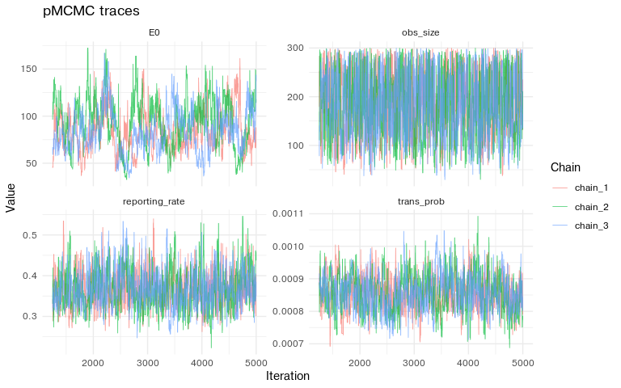

``` r
chlaa_plot_parameter_distributions(
  synthetic_particle,
  parameters = natural_fit_names,
  burnin = 0.25,
  scale = "natural",
  truth = truth_vec
)
```

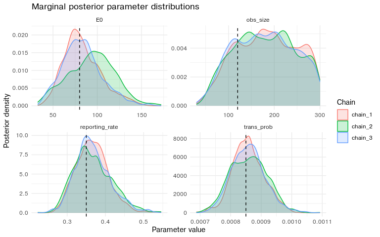

``` r
chlaa_plot_parameter_pairs(
  synthetic_particle,
  parameters = natural_fit_names,
  burnin = 0.25,
  scale = "natural",
  truth = truth_vec,
  max_points = 3000
)
```

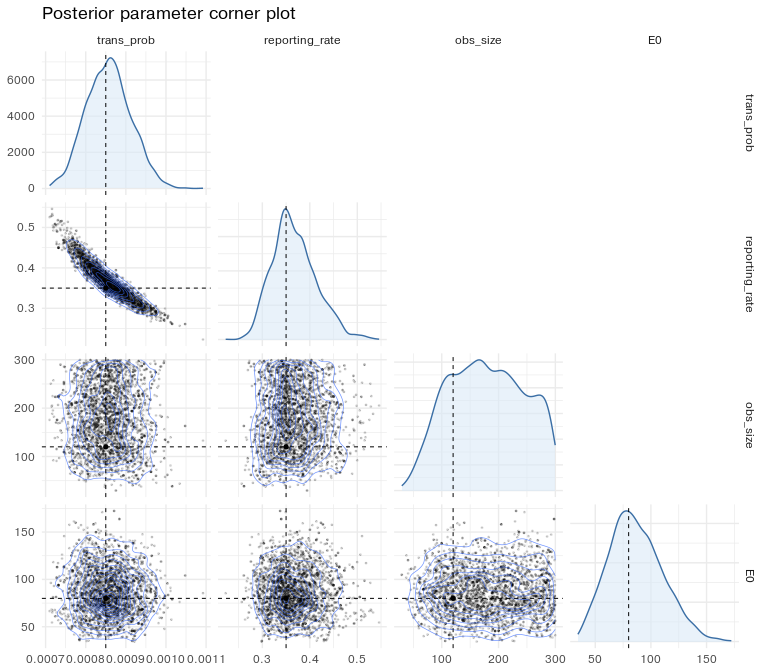

Finally, the posterior predictive check asks whether the fitted model
can regenerate data like the observed weekly counts.

``` r
plot_case_fit(
  synthetic_particle,
  synthetic_weekly,
  "Posterior predictive fit to synthetic weekly cases",
  seed = 401
)
```

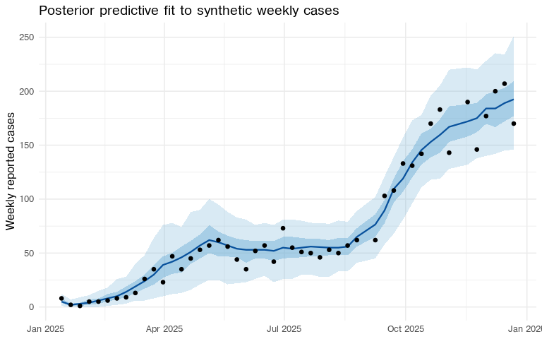

Real Kirotshe fit
=================

The real-data fit follows the same deterministic-to-particle sequence.
There is no known truth, so the emphasis shifts to chain agreement,
predictive fit, and whether the inferred parameter values are
epidemiologically plausible.

``` r
real_starts <- list(
  make_start(trans_prob = 2.0e-3, reporting_rate = 0.12, obs_size = 5, E0 = 600),
  make_start(trans_prob = 6.0e-4, reporting_rate = 0.60, obs_size = 50, E0 = 1000),
  make_start(trans_prob = 3.0e-3, reporting_rate = 0.20, obs_size = 10, E0 = 300)
)

imap_dfr(real_starts, \(pars, chain) tibble(
  chain = paste0("chain_", chain),
  parameter = natural_fit_names,
  value = unlist(pars[natural_fit_names])
)) |>
  pivot_wider(names_from = parameter, values_from = value)
#> # A tibble: 3 × 5
#>   chain   trans_prob reporting_rate obs_size    E0
#>   <chr>        <dbl>          <dbl>    <dbl> <dbl>
#> 1 chain_1     0.002            0.12        5   600
#> 2 chain_2     0.0006           0.6        50  1000
#> 3 chain_3     0.003            0.2        10   300
```

Deterministic fit
-----------------

The real-data pilot again learns a proposal covariance with the
deterministic filter. This keeps the expensive particle-filter stage
focused on a proposal that already knows the posterior ridge.

``` r
real_pilot <- chlaa_fit_pmcmc(
  data = fit_data_real,
  pars = real_starts[[1]],
  chain_pars = real_starts,
  n_chains = n_chains,
  n_particles = 1,
  n_steps = pilot_steps,
  seed = 501,
  prior = fit_prior,
  packer = make_packer(real_starts[[1]]),
  proposal_var = pilot_proposal,
  obs_interval = 7,
  time_start = 0,
  deterministic = TRUE
)
```

``` r
acceptance_summary(real_pilot, "real pilot")
#> # A tibble: 3 × 4
#>   stage      chain   acceptance_rate n_iterations
#>   <chr>      <chr>             <dbl>        <int>
#> 1 real pilot chain_1           0.128         3750
#> 2 real pilot chain_2           0.138         3750
#> 3 real pilot chain_3           0.134         3750
```

``` r
real_det_proposal <- proposal_from_fit(
  real_pilot,
  burnin = 0.25,
  scale = 1
)

round(cov2cor(real_det_proposal), 2)
#>                      log_trans_prob logit_reporting_rate log_obs_size log_E0
#> log_trans_prob                 1.00                -0.97         0.09  -0.20
#> logit_reporting_rate          -0.97                 1.00        -0.11   0.11
#> log_obs_size                   0.09                -0.11         1.00  -0.04
#> log_E0                        -0.20                 0.11        -0.04   1.00
```

``` r
real_det <- chlaa_fit_pmcmc(
  data = fit_data_real,
  pars = real_starts[[1]],
  chain_pars = real_starts,
  n_chains = n_chains,
  n_particles = 1,
  n_steps = deterministic_steps,
  seed = 601,
  prior = fit_prior,
  packer = make_packer(real_starts[[1]]),
  proposal_var = real_det_proposal,
  obs_interval = 7,
  time_start = 0,
  deterministic = TRUE
)
```

``` r
acceptance_summary(real_det, "real deterministic")
#> # A tibble: 3 × 4
#>   stage              chain   acceptance_rate n_iterations
#>   <chr>              <chr>             <dbl>        <int>
#> 1 real deterministic chain_1           0.252        15000
#> 2 real deterministic chain_2           0.254        15000
#> 3 real deterministic chain_3           0.250        15000
ess_summary(real_det, "real deterministic")
#> # A tibble: 12 × 4
#>    stage              chain   parameter              ess
#>    <chr>              <chr>   <chr>                <dbl>
#>  1 real deterministic chain_1 log_trans_prob        894.
#>  2 real deterministic chain_1 logit_reporting_rate  838.
#>  3 real deterministic chain_1 log_obs_size         1135.
#>  4 real deterministic chain_1 log_E0                944.
#>  5 real deterministic chain_2 log_trans_prob        971.
#>  6 real deterministic chain_2 logit_reporting_rate  926.
#>  7 real deterministic chain_2 log_obs_size          915.
#>  8 real deterministic chain_2 log_E0                961.
#>  9 real deterministic chain_3 log_trans_prob       1041.
#> 10 real deterministic chain_3 logit_reporting_rate 1060.
#> 11 real deterministic chain_3 log_obs_size         1019.
#> 12 real deterministic chain_3 log_E0                951.
rhat_summary(real_det, "real deterministic")
#> # A tibble: 4 × 4
#>   stage              parameter             rhat rhat_upper
#>   <chr>              <chr>                <dbl>      <dbl>
#> 1 real deterministic log_trans_prob        1.00       1.00
#> 2 real deterministic logit_reporting_rate  1.00       1.00
#> 3 real deterministic log_obs_size          1.00       1.01
#> 4 real deterministic log_E0                1.00       1.00
```

``` r
parameter_summary(real_det, "real deterministic")
#> # A tibble: 4 × 5
#>   stage              parameter           q025    median       q975
#>   <chr>              <chr>              <dbl>     <dbl>      <dbl>
#> 1 real deterministic E0             460.      691.      1049.     
#> 2 real deterministic obs_size         5.06      8.24      13.4    
#> 3 real deterministic reporting_rate   0.0614    0.0967     0.179  
#> 4 real deterministic trans_prob       0.00102   0.00165    0.00252
```

``` r
chlaa_plot_trace(
  real_det,
  parameters = natural_fit_names,
  burnin = 0.25,
  scale = "natural"
)
```

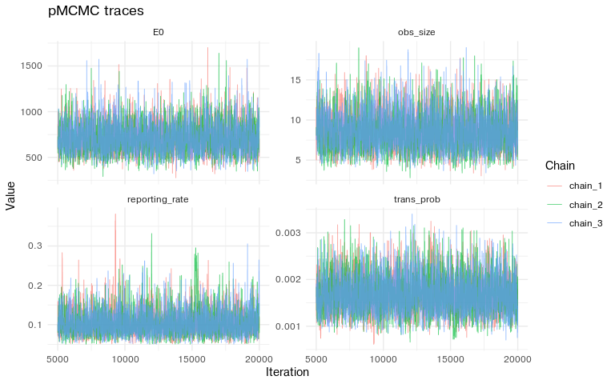

``` r
chlaa_plot_parameter_pairs(
  real_det,
  parameters = natural_fit_names,
  burnin = 0.25,
  scale = "natural",
  max_points = 3000
)
```

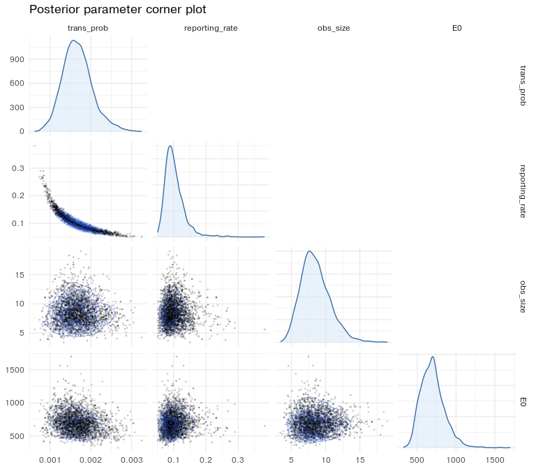

Particle pMCMC
--------------

The real particle chains use 50 particles. The proposal is shrunk more
than in the synthetic example because the real likelihood is noisier and
the posterior is tighter around a low `obs_size`.

``` r
real_particle_starts <- chain_median_starts(
  real_det,
  template_pars = real_starts[[1]],
  burnin = 0.25
)
```

``` r
real_particle_proposal <- proposal_from_fit(
  real_det,
  burnin = 0.25,
  scale = 0.2
)
```

``` r
real_particle <- chlaa_fit_pmcmc(
  data = fit_data_real,
  pars = real_particle_starts[[1]],
  chain_pars = real_particle_starts,
  n_chains = n_chains,
  n_particles = particle_count,
  n_steps = particle_steps,
  seed = 701,
  prior = fit_prior,
  packer = make_packer(real_particle_starts[[1]]),
  proposal_var = real_particle_proposal,
  obs_interval = 7,
  time_start = 0,
  deterministic = FALSE
)
```

``` r
acceptance_summary(real_particle, "real particle")
#> # A tibble: 3 × 4
#>   stage         chain   acceptance_rate n_iterations
#>   <chr>         <chr>             <dbl>        <int>
#> 1 real particle chain_1           0.582         3750
#> 2 real particle chain_2           0.598         3750
#> 3 real particle chain_3           0.587         3750
```

``` r
ess_summary(real_particle, "real particle")
#> # A tibble: 12 × 4
#>    stage         chain   parameter              ess
#>    <chr>         <chr>   <chr>                <dbl>
#>  1 real particle chain_1 log_trans_prob        169.
#>  2 real particle chain_1 logit_reporting_rate  170.
#>  3 real particle chain_1 log_obs_size          128.
#>  4 real particle chain_1 log_E0                124.
#>  5 real particle chain_2 log_trans_prob        113.
#>  6 real particle chain_2 logit_reporting_rate  112.
#>  7 real particle chain_2 log_obs_size          155.
#>  8 real particle chain_2 log_E0                118.
#>  9 real particle chain_3 log_trans_prob        130.
#> 10 real particle chain_3 logit_reporting_rate  126.
#> 11 real particle chain_3 log_obs_size          136.
#> 12 real particle chain_3 log_E0                115.
rhat_summary(real_particle, "real particle")
#> # A tibble: 4 × 4
#>   stage         parameter             rhat rhat_upper
#>   <chr>         <chr>                <dbl>      <dbl>
#> 1 real particle log_trans_prob        1.02       1.04
#> 2 real particle logit_reporting_rate  1.01       1.03
#> 3 real particle log_obs_size          1.00       1.00
#> 4 real particle log_E0                1.00       1.01
```

``` r
parameter_summary(real_particle, "real particle")
#> # A tibble: 4 × 5
#>   stage         parameter            q025    median       q975
#>   <chr>         <chr>               <dbl>     <dbl>      <dbl>
#> 1 real particle E0             435.       677.      1082.     
#> 2 real particle obs_size         5.15       8.50      13.4    
#> 3 real particle reporting_rate   0.0618     0.0977     0.190  
#> 4 real particle trans_prob       0.000988   0.00163    0.00249
```

``` r
chlaa_plot_trace(
  real_particle,
  parameters = natural_fit_names,
  burnin = 0.25,
  scale = "natural"
)
```

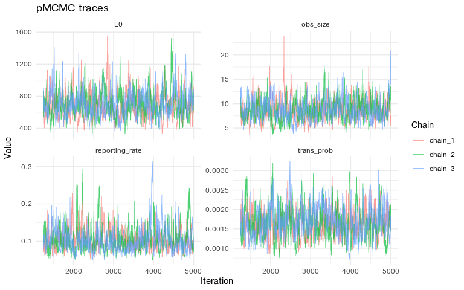

``` r
chlaa_plot_parameter_distributions(
  real_particle,
  parameters = natural_fit_names,
  burnin = 0.25,
  scale = "natural"
)
```

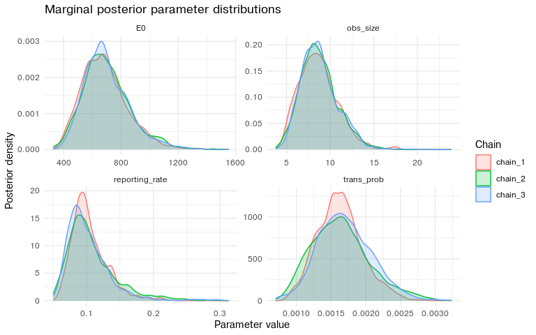

``` r
chlaa_plot_parameter_pairs(
  real_particle,
  parameters = natural_fit_names,
  burnin = 0.25,
  scale = "natural",
  max_points = 3000
)
```

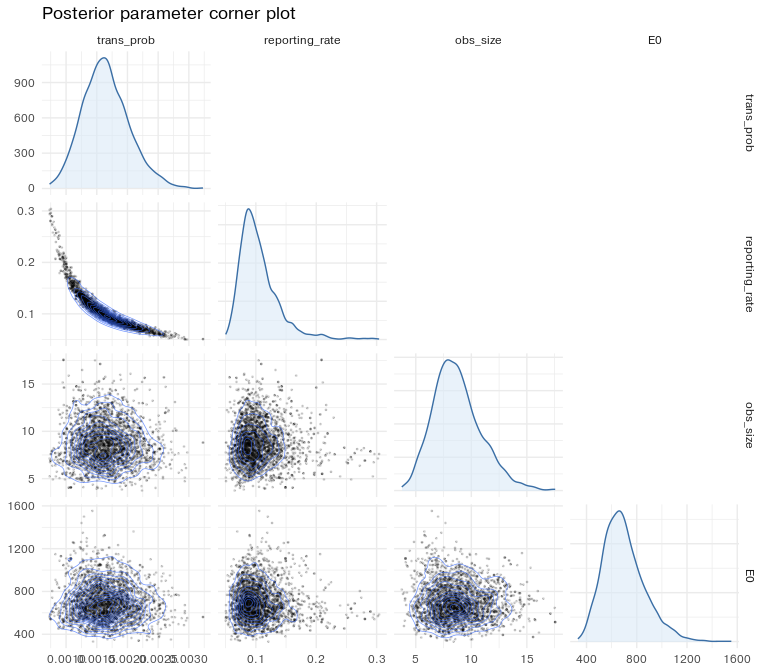

The posterior predictive fit captures the broad two-wave structure. If
the highest late observations remain systematically above the median,
that is a model signal: the next model comparison should consider
additional seeding, initial-condition structure, or limited
person-to-person transmission.

``` r
plot_case_fit(
  real_particle,
  kirotshe,
  "Posterior predictive fit to Kirotshe weekly cases",
  seed = 801
)
```

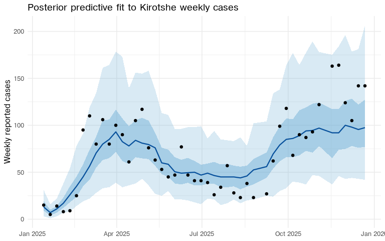

The fitted stochastic pMCMC object is saved as package example data. The
scenario and health-economics vignettes read this object, so they can
start from the fitted Kirotshe posterior rather than refitting the
particle filter.

``` r
fit_artifact <- list(
  fit = real_particle,
  pars = attr(real_particle, "start_pars", exact = TRUE),
  observed = kirotshe,
  interventions = kirotshe_meta,
  outbreak_start = outbreak_start,
  outbreak_end = outbreak_end,
  burnin = 0.25,
  particle_count = particle_count
)

artifact_path <- repo_output_file("inst", "extdata", "kirotshe_particle_fit.rds")
saveRDS(fit_artifact, artifact_path)
artifact_path
#> [1] "../inst/extdata/kirotshe_particle_fit.rds"
```

Reading the diagnostics
=======================

The synthetic fit is the calibration check: the known truth should sit
inside the posterior intervals and near the high-density region of the
marginal and joint posterior plots. The real fit then asks a different
question: whether the small fitted model is stable enough to use as a
baseline for scenario analysis.

The diagnostic tables and plots should be read together. Trace plots
show movement and chain overlap. ESS shows how much independent
information the saved draws contain. R-hat shows whether chains started
from different points have settled into the same distribution. Posterior
predictive plots show whether parameter uncertainty and observation
noise generate outbreak curves like the observed data.
